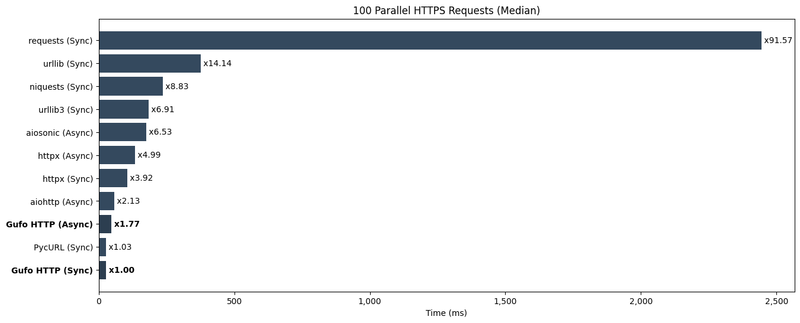

---
hide:
    - navigation
---
# Python HTTP Clients Benchmark

!!! warning "Disclaimer"

    All following information is provided only for reference.
    These tests are performed by [Gufo Labs][Gufo Labs] to estimate the performance
    of [Gufo HTTP][Gufo HTTP] against major competitors, so they cannot be considered
    independent and unbiased.

!!! note

    Although performance is an absolute requirement for [Gufo Stack][Gufo Stack],
    other factors such as maturity, community, features, examples, and existing code base
    should also be considered.

## Abstract
This benchmark evaluates several Python HTTP client libraries:

- [Gufo HTTP][Gufo HTTP] (current version)
- [aiohttp][aiohttp] (3.9.3)
- [aiosonic][aiosonic] (0.18.0)
- [httpx][httpx] (0.27)
- [requests][requests] (2.31.0)
- [niquests][niquests] (3.5.2)
- [PycURL][pycurl] (7.45.3)
- [urllib][urllib] from Python standard library
- [urllib3][urllib3] (2.2.1)

The evaluation covers the following aspects:

* Performance in synchronous (blocking) mode, if supported.
* Performance in asynchronous (non-blocking) mode, if supported.
* Performance in plain-text (HTTP) and encrypted (HTTPS) modes.
* Ability to maintain pools of connections.
* The efficiency of the resolver.
* Ability to release GIL in multi-threaded applications.

All benchmarks are performed against a local nginx installation
using wrapper, provided by `gufo.http.httpd`.

The benchmarking environment utilizes an AWS EC2 t2.xlarge (64-bit) instance running Debian 12. 
Median values are used for benchmark ranking.

## Preparing

Start clear AWS EC2 t2.xlarge (64 bit) instance with Debian 12.

Prepare node:
```
sudo apt-get update
sudo apt-get install --yes git python3.11-venv
python3 -m venv bench
cd bench
. bin/activate
```

Clone repo:
```
git clone https://github.com/gufolabs/gufo_http.git
cd gufo_http
```

Install local nginx:
```
./tools/build/setup-nginx.sh
```

Install dependencies:

```
pip3 install -r .requirements/test.txt -r .requirements/bench.txt gufo-http
```

## HTTP/1.1 Requests

### Single Requests

Perform http requests to read 1kb text file. This test evaluates:

* The cost of client's initialization.
* The efficiency of the network code.
* The efficiency of the resolver.
* The efficiency HTTP/1.1 parser. 

Run tests:
```
pytest benchmarks/test_single_x100_1k.py
```

**Results (lower is better)**
```
================================================================= test session starts =================================================================
platform linux -- Python 3.11.2, pytest-7.4.3, pluggy-1.4.0
benchmark: 4.0.0 (defaults: timer=time.perf_counter disable_gc=False min_rounds=5 min_time=0.000005 max_time=1.0 calibration_precision=10 warmup=False warmup_iterations=100000)
rootdir: /home/admin/bench/gufo_http
plugins: anyio-4.3.0, benchmark-4.0.0
collected 11 items                                                                                                                                    

benchmarks/test_single_x100_1k.py ...........                                                                                                   [100%]


----------------------------------------------------------------------------------------------- benchmark: 11 tests -----------------------------------------------------------------------------------------------
Name (time in us)                Min                    Max                   Mean                StdDev                 Median                   IQR            Outliers         OPS            Rounds  Iterations
-------------------------------------------------------------------------------------------------------------------------------------------------------------------------------------------------------------------
test_urllib3_sync           554.4570 (1.0)       1,536.1650 (1.83)        632.6178 (1.0)         62.9339 (1.73)        621.2800 (1.0)         36.4180 (1.0)         51;43  1,580.7332 (1.0)         715           1
test_pycurl_sync            629.4390 (1.14)        837.4340 (1.0)         696.9158 (1.10)        42.7311 (1.17)        685.7915 (1.10)        53.6650 (1.47)         20;2  1,434.8935 (0.91)         68           1
test_urllib_sync            689.3360 (1.24)        930.5660 (1.11)        771.1619 (1.22)        36.3905 (1.0)         763.9255 (1.23)        41.8110 (1.15)       168;25  1,296.7445 (0.82)        704           1
test_gufo_http_sync       1,028.8110 (1.86)      1,492.4360 (1.78)      1,147.2073 (1.81)        73.6414 (2.02)      1,129.8320 (1.82)        87.5698 (2.40)         13;2    871.6820 (0.55)         67           1
test_gufo_http_async      1,305.4320 (2.35)      2,491.2770 (2.97)      1,440.9713 (2.28)       121.9038 (3.35)      1,413.2970 (2.27)        89.5060 (2.46)        27;19    693.9763 (0.44)        390           1
test_niquests_sync        1,566.6530 (2.83)     21,821.0800 (26.06)     1,849.7786 (2.92)       966.5830 (26.56)     1,708.1240 (2.75)       133.7685 (3.67)         7;98    540.6052 (0.34)        456           1
test_requests_sync        1,795.1610 (3.24)      2,449.7940 (2.93)      1,929.5940 (3.05)       133.8849 (3.68)      1,884.6200 (3.03)       113.1722 (3.11)          6;3    518.2437 (0.33)         47           1
test_aiosonic_async       2,052.7380 (3.70)      3,719.5100 (4.44)      2,328.1077 (3.68)       252.0696 (6.93)      2,261.1500 (3.64)       120.4875 (3.31)        41;41    429.5334 (0.27)        397           1
test_aiohttp_async        2,281.1770 (4.11)      8,044.2500 (9.61)      2,471.1011 (3.91)       339.5952 (9.33)      2,441.3350 (3.93)        95.5642 (2.62)          3;8    404.6779 (0.26)        323           1
test_httpx_sync          42,599.5430 (76.83)    57,718.0800 (68.92)    44,626.5008 (70.54)    3,823.4559 (105.07)   43,551.6350 (70.10)      390.4130 (10.72)         2;7     22.4082 (0.01)         22           1
test_httpx_async         45,008.0350 (81.17)    55,920.3020 (66.78)    47,489.2551 (75.07)    2,944.8098 (80.92)    46,456.6860 (74.78)    2,560.7410 (70.32)         2;2     21.0574 (0.01)         18           1
-------------------------------------------------------------------------------------------------------------------------------------------------------------------------------------------------------------------

Legend:
  Outliers: 1 Standard Deviation from Mean; 1.5 IQR (InterQuartile Range) from 1st Quartile and 3rd Quartile.
  OPS: Operations Per Second, computed as 1 / Mean
================================================================= 11 passed in 9.41s ==================================================================
```


*Lower is better*

### 100 Linear Requests

Perform set of 100 linear http requests to read 1kb text file using single client session
whenever possible. This test evaluates:

* The efficiency of the network code.
* The efficency of the HTTP/1.1 parser.
* An ability to maintain connection pools.

Run tests:
```
pytest benchmarks/test_linear_x100_1k.py
```

**Results (lower is better)**
```
================================================================= test session starts =================================================================
platform linux -- Python 3.11.2, pytest-7.4.3, pluggy-1.4.0
benchmark: 4.0.0 (defaults: timer=time.perf_counter disable_gc=False min_rounds=5 min_time=0.000005 max_time=1.0 calibration_precision=10 warmup=False warmup_iterations=100000)
rootdir: /home/admin/bench/gufo_http
plugins: anyio-4.3.0, benchmark-4.0.0
collected 11 items                                                                                                                                    

benchmarks/test_linear_x100_1k.py ...........                                                                                                   [100%]


----------------------------------------------------------------------------------- benchmark: 11 tests ------------------------------------------------------------------------------------
Name (time in ms)             Min                 Max                Mean            StdDev              Median               IQR            Outliers      OPS            Rounds  Iterations
--------------------------------------------------------------------------------------------------------------------------------------------------------------------------------------------
test_pycurl_sync          15.7209 (1.0)       17.4826 (1.0)       16.5177 (1.0)      0.4374 (1.0)       16.5259 (1.0)      0.4625 (1.0)          18;2  60.5410 (1.0)          60           1
test_gufo_http_sync       17.8568 (1.14)      20.7740 (1.19)      19.4510 (1.18)     0.7784 (1.78)      19.6666 (1.19)     1.0538 (2.28)         19;0  51.4113 (0.85)         52           1
test_gufo_http_async      32.0142 (2.04)      36.6345 (2.10)      35.0291 (2.12)     1.1316 (2.59)      35.1273 (2.13)     1.2688 (2.74)          9;1  28.5477 (0.47)         30           1
test_aiohttp_async        42.9462 (2.73)      46.6140 (2.67)      45.0808 (2.73)     0.8582 (1.96)      44.8978 (2.72)     1.0455 (2.26)          5;1  22.1824 (0.37)         22           1
test_aiosonic_async       46.4653 (2.96)      49.4529 (2.83)      47.7811 (2.89)     0.6290 (1.44)      47.7124 (2.89)     0.5660 (1.22)          4;2  20.9288 (0.35)         21           1
test_urllib3_sync         54.1701 (3.45)      56.8959 (3.25)      55.3582 (3.35)     0.7389 (1.69)      55.4057 (3.35)     1.1371 (2.46)          5;0  18.0642 (0.30)         18           1
test_urllib_sync          73.9660 (4.70)      79.5802 (4.55)      75.9264 (4.60)     1.4029 (3.21)      75.6989 (4.58)     1.2797 (2.77)          3;1  13.1707 (0.22)         14           1
test_niquests_sync        94.7829 (6.03)     115.4204 (6.60)      97.9240 (5.93)     5.9087 (13.51)     95.8562 (5.80)     2.3509 (5.08)          1;1  10.2120 (0.17)         11           1
test_httpx_sync          116.1272 (7.39)     123.0537 (7.04)     119.6039 (7.24)     2.2205 (5.08)     120.0800 (7.27)     2.6723 (5.78)          4;0   8.3609 (0.14)          9           1
test_httpx_async         174.0273 (11.07)    180.2973 (10.31)    177.9930 (10.78)    3.0217 (6.91)     179.6829 (10.87)    5.8687 (12.69)         2;0   5.6182 (0.09)          6           1
test_requests_sync       189.3613 (12.05)    194.5671 (11.13)    191.7294 (11.61)    1.9597 (4.48)     191.9551 (11.62)    3.1663 (6.85)          3;0   5.2157 (0.09)          6           1
--------------------------------------------------------------------------------------------------------------------------------------------------------------------------------------------

Legend:
  Outliers: 1 Standard Deviation from Mean; 1.5 IQR (InterQuartile Range) from 1st Quartile and 3rd Quartile.
  OPS: Operations Per Second, computed as 1 / Mean
================================================================= 11 passed in 15.62s =================================================================
```


*Lower is better*

### 100 Parallel Requests

Perform 100 HTTP/1.1 requests to read 1kb text file with concurrency of 4 maintaininng
single client session per thread/coroutine.

* The efficiency of the network code.
* The efficency of the HTTP/1.1 parser.
* An ability to maintain connection pools.
* Granularity of the internal locks.
* Ability to release GIL when runnning native code.

Run tests:
```
pytest benchmarks/test_p4_x100_1k.py
```

**Results (lower is better)**
```
================================================================= test session starts =================================================================
platform linux -- Python 3.11.2, pytest-7.4.3, pluggy-1.4.0
benchmark: 4.0.0 (defaults: timer=time.perf_counter disable_gc=False min_rounds=5 min_time=0.000005 max_time=1.0 calibration_precision=10 warmup=False warmup_iterations=100000)
rootdir: /home/admin/bench/gufo_http
plugins: anyio-4.3.0, benchmark-4.0.0
collected 11 items                                                                                                                                    

benchmarks/test_p4_x100_1k.py ...........                                                                                                       [100%]


------------------------------------------------------------------------------------ benchmark: 11 tests -------------------------------------------------------------------------------------
Name (time in ms)             Min                 Max                Mean            StdDev              Median                IQR            Outliers       OPS            Rounds  Iterations
----------------------------------------------------------------------------------------------------------------------------------------------------------------------------------------------
test_gufo_http_sync        8.0439 (1.0)       12.3677 (1.02)       9.9901 (1.0)      0.7297 (1.11)       9.9671 (1.0)       0.8344 (1.17)         16;5  100.0993 (1.0)          76           1
test_pycurl_sync           8.4782 (1.05)      12.1379 (1.0)       10.4156 (1.04)     0.8120 (1.24)      10.4619 (1.05)      1.0731 (1.51)         29;0   96.0097 (0.96)         90           1
test_gufo_http_async      21.6504 (2.69)      24.3966 (2.01)      22.8209 (2.28)     0.6571 (1.0)       22.7816 (2.29)      0.7117 (1.0)          14;2   43.8195 (0.44)         39           1
test_aiosonic_async       34.8526 (4.33)      39.4812 (3.25)      36.8918 (3.69)     1.1007 (1.68)      37.0412 (3.72)      1.4879 (2.09)          7;0   27.1063 (0.27)         26           1
test_aiohttp_async        38.7963 (4.82)      50.5832 (4.17)      40.5610 (4.06)     2.3938 (3.64)      39.8064 (3.99)      2.0563 (2.89)          1;1   24.6542 (0.25)         24           1
test_urllib_sync          44.0200 (5.47)      48.4414 (3.99)      46.0278 (4.61)     0.9189 (1.40)      45.9976 (4.61)      1.1174 (1.57)          4;1   21.7260 (0.22)         22           1
test_urllib3_sync         59.5702 (7.41)      62.8944 (5.18)      60.6641 (6.07)     0.9540 (1.45)      60.3036 (6.05)      1.1052 (1.55)          4;1   16.4842 (0.16)         17           1
test_niquests_sync       103.6997 (12.89)    127.1946 (10.48)    107.7241 (10.78)    6.9286 (10.54)    105.7414 (10.61)     2.0290 (2.85)          1;1    9.2830 (0.09)         10           1
test_requests_sync       169.1568 (21.03)    173.9227 (14.33)    171.3491 (17.15)    1.9588 (2.98)     170.8775 (17.14)     3.7797 (5.31)          3;0    5.8360 (0.06)          6           1
test_httpx_sync          228.8940 (28.46)    240.2867 (19.80)    233.2785 (23.35)    5.2410 (7.98)     229.9074 (23.07)     8.6472 (12.15)         1;0    4.2867 (0.04)          5           1
test_httpx_async         289.7245 (36.02)    303.9310 (25.04)    296.9236 (29.72)    6.8107 (10.37)    296.9415 (29.79)    13.3072 (18.70)         2;0    3.3679 (0.03)          5           1
----------------------------------------------------------------------------------------------------------------------------------------------------------------------------------------------

Legend:
  Outliers: 1 Standard Deviation from Mean; 1.5 IQR (InterQuartile Range) from 1st Quartile and 3rd Quartile.
  OPS: Operations Per Second, computed as 1 / Mean
================================================================= 11 passed in 15.82s =================================================================
```


*Lower is better*

## HTTPS Requests

### Single Requests

Perform HTTP/2 requests to read 1kb text file. This test evaluates:

* The cost of client's initialization.
* The efficiency of the network code.
* The efficiency HTTP/1.1 or HTTP/2 parser. 
* The efficency of the crypto.
* The efficiency of the resolver.

Run tests:
```
pytest benchmarks/test_https_single_x100_1k.py
```

**Results (lower is better)**
```
================================================================= test session starts =================================================================
platform linux -- Python 3.11.2, pytest-7.4.3, pluggy-1.4.0
benchmark: 4.0.0 (defaults: timer=time.perf_counter disable_gc=False min_rounds=5 min_time=0.000005 max_time=1.0 calibration_precision=10 warmup=False warmup_iterations=100000)
rootdir: /home/admin/bench/gufo_http
plugins: anyio-4.3.0, benchmark-4.0.0
collected 11 items                                                                                                                                    

benchmarks/test_https_single_x100_1k.py ...........                                                                                             [100%]


--------------------------------------------------------------------------------- benchmark: 11 tests ----------------------------------------------------------------------------------
Name (time in ms)            Min                Max               Mean            StdDev             Median               IQR            Outliers      OPS            Rounds  Iterations
----------------------------------------------------------------------------------------------------------------------------------------------------------------------------------------
test_pycurl_sync         10.0175 (1.0)      12.0872 (1.0)      10.2290 (1.0)      0.4147 (1.10)     10.1222 (1.0)      0.1027 (1.0)           3;4  97.7609 (1.0)          62           1
test_gufo_http_sync      10.0597 (1.00)     13.0244 (1.08)     10.4489 (1.02)     0.5979 (1.59)     10.2685 (1.01)     0.2163 (2.11)          6;9  95.7036 (0.98)         73           1
test_gufo_http_async     10.3528 (1.03)     13.2080 (1.09)     10.7742 (1.05)     0.4577 (1.22)     10.6623 (1.05)     0.2691 (2.62)          4;4  92.8143 (0.95)         85           1
test_urllib_sync         11.2151 (1.12)     20.4371 (1.69)     11.6105 (1.14)     1.0735 (2.86)     11.4075 (1.13)     0.1948 (1.90)          4;5  86.1292 (0.88)         83           1
test_httpx_sync          11.4543 (1.14)     14.0466 (1.16)     11.8267 (1.16)     0.4756 (1.27)     11.6695 (1.15)     0.2974 (2.90)          8;7  84.5546 (0.86)         79           1
test_aiohttp_async       12.9571 (1.29)     15.0958 (1.25)     13.3663 (1.31)     0.5476 (1.46)     13.1705 (1.30)     0.2873 (2.80)          2;2  74.8148 (0.77)         19           1
test_httpx_async         13.8272 (1.38)     15.5035 (1.28)     14.2621 (1.39)     0.3758 (1.0)      14.1863 (1.40)     0.3401 (3.31)          7;3  70.1158 (0.72)         42           1
test_urllib3_sync        52.2947 (5.22)     55.5100 (4.59)     53.5159 (5.23)     0.8129 (2.16)     53.3167 (5.27)     0.8969 (8.73)          5;1  18.6861 (0.19)         20           1
test_aiosonic_async      52.5721 (5.25)     59.7053 (4.94)     53.8514 (5.26)     1.5025 (4.00)     53.4758 (5.28)     0.7073 (6.89)          1;1  18.5696 (0.19)         19           1
test_niquests_sync       53.1531 (5.31)     55.9122 (4.63)     54.2606 (5.30)     0.7590 (2.02)     54.3079 (5.37)     0.8548 (8.32)          7;1  18.4296 (0.19)         19           1
test_requests_sync       53.3831 (5.33)     55.6010 (4.60)     54.8199 (5.36)     0.6931 (1.84)     55.0437 (5.44)     1.0851 (10.57)         7;0  18.2415 (0.19)         17           1
----------------------------------------------------------------------------------------------------------------------------------------------------------------------------------------

Legend:
  Outliers: 1 Standard Deviation from Mean; 1.5 IQR (InterQuartile Range) from 1st Quartile and 3rd Quartile.
  OPS: Operations Per Second, computed as 1 / Mean
========================================================== 11 passed, 45 warnings in 15.69s ===========================================================
```


*Lower is better*

### 100 Linear Requests
Perform set of 100 linear HTTPS requests to read 1kb text file using single client session
whenever possible. This test evaluates:

* The efficiency of the network code.
* The efficency of the HTTP/1.1 parser.
* An ability to maintain connection pools.
* The efficency of the crypto.

Run tests:
```
pytest benchmarks/test_https_linear_x100_1k.py
```

**Results (lower is better)**

```
================================================================= test session starts =================================================================
platform linux -- Python 3.11.2, pytest-7.4.3, pluggy-1.4.0
benchmark: 4.0.0 (defaults: timer=time.perf_counter disable_gc=False min_rounds=5 min_time=0.000005 max_time=1.0 calibration_precision=10 warmup=False warmup_iterations=100000)
rootdir: /home/admin/bench/gufo_http
plugins: anyio-4.3.0, benchmark-4.0.0
collected 11 items                                                                                                                                    

benchmarks/test_https_linear_x100_1k.py ...........                                                                                             [100%]


---------------------------------------------------------------------------------------- benchmark: 11 tests -----------------------------------------------------------------------------------------
Name (time in ms)               Min                   Max                  Mean             StdDev                Median                IQR            Outliers      OPS            Rounds  Iterations
------------------------------------------------------------------------------------------------------------------------------------------------------------------------------------------------------
test_pycurl_sync            26.3421 (1.0)         30.1005 (1.0)         27.4302 (1.0)       0.8045 (1.0)         27.2414 (1.0)       0.9238 (1.0)           7;2  36.4562 (1.0)          34           1
test_gufo_http_sync         31.7724 (1.21)        37.4644 (1.24)        33.4854 (1.22)      1.3531 (1.68)        33.0871 (1.21)      1.2693 (1.37)          6;2  29.8637 (0.82)         29           1
test_gufo_http_async        48.5834 (1.84)        52.5665 (1.75)        50.5041 (1.84)      1.0680 (1.33)        50.3793 (1.85)      1.1559 (1.25)          6;0  19.8004 (0.54)         20           1
test_aiohttp_async          61.9829 (2.35)        65.8641 (2.19)        63.6917 (2.32)      1.2468 (1.55)        63.5328 (2.33)      1.3593 (1.47)          4;0  15.7006 (0.43)         10           1
test_httpx_sync             89.3649 (3.39)        94.1770 (3.13)        91.9501 (3.35)      1.2780 (1.59)        91.9369 (3.37)      1.4473 (1.57)          2;0  10.8755 (0.30)         11           1
test_aiosonic_async        103.2271 (3.92)       113.2592 (3.76)       106.2470 (3.87)      2.8638 (3.56)       105.6261 (3.88)      1.3499 (1.46)          2;2   9.4120 (0.26)         10           1
test_urllib3_sync          115.4779 (4.38)       122.0520 (4.05)       118.5464 (4.32)      2.3145 (2.88)       118.2140 (4.34)      3.8105 (4.12)          3;0   8.4355 (0.23)          9           1
test_httpx_async           140.8665 (5.35)       148.0266 (4.92)       144.0411 (5.25)      2.9127 (3.62)       143.0293 (5.25)      5.1042 (5.53)          2;0   6.9425 (0.19)          7           1
test_niquests_sync         169.7255 (6.44)       175.5512 (5.83)       171.7667 (6.26)      2.0632 (2.56)       171.2311 (6.29)      1.9346 (2.09)          1;1   5.8218 (0.16)          6           1
test_urllib_sync         1,138.9195 (43.24)    1,156.0135 (38.41)    1,149.2373 (41.90)     6.8444 (8.51)     1,148.9634 (42.18)     9.8515 (10.66)         1;0   0.8701 (0.02)          5           1
test_requests_sync       5,543.3235 (210.44)   5,582.3273 (185.46)   5,564.8142 (202.87)   15.1227 (18.80)    5,568.6101 (204.42)   21.9277 (23.74)         2;0   0.1797 (0.00)          5           1
------------------------------------------------------------------------------------------------------------------------------------------------------------------------------------------------------

Legend:
  Outliers: 1 Standard Deviation from Mean; 1.5 IQR (InterQuartile Range) from 1st Quartile and 3rd Quartile.
  OPS: Operations Per Second, computed as 1 / Mean
==================================================== 11 passed, 1215 warnings in 62.84s (0:01:02) =====================================================
```


*Lower is better*

### 100 Parralel Requests
Perform 100 HTTPS requests to read 1kb text file with concurrency of 4 maintaininng
single client session per thread/coroutine.

* The efficiency of the network code.
* The efficency of the HTTP/1.1 parser.
* An ability to maintain connection pools.
* Granularity of the internal locks.
* Ability to release GIL when runnning native code.

Run tests:
```
pytest benchmarks/test_https_p4_x100_1k.py
```

**Results (lower is better)**
```
================================================================= test session starts =================================================================
platform linux -- Python 3.11.2, pytest-7.4.3, pluggy-1.4.0
benchmark: 4.0.0 (defaults: timer=time.perf_counter disable_gc=False min_rounds=5 min_time=0.000005 max_time=1.0 calibration_precision=10 warmup=False warmup_iterations=100000)
rootdir: /home/admin/bench/gufo_http
plugins: anyio-4.3.0, benchmark-4.0.0
collected 11 items                                                                                                                                    

benchmarks/test_https_p4_x100_1k.py ...........                                                                                                 [100%]


----------------------------------------------------------------------------------------- benchmark: 11 tests -----------------------------------------------------------------------------------------
Name (time in ms)               Min                   Max                  Mean             StdDev                Median                 IQR            Outliers      OPS            Rounds  Iterations
-------------------------------------------------------------------------------------------------------------------------------------------------------------------------------------------------------
test_gufo_http_sync         20.6258 (1.0)         37.0803 (1.26)        26.4525 (1.05)      3.7755 (1.64)        25.9621 (1.04)       3.8212 (2.20)          6;2  37.8036 (0.95)         29           1
test_pycurl_sync            21.1610 (1.03)        29.3905 (1.0)         25.1359 (1.0)       2.3022 (1.0)         24.9755 (1.0)        4.2328 (2.44)         17;0  39.7838 (1.0)          39           1
test_gufo_http_async        35.8372 (1.74)        60.1148 (2.05)        46.7498 (1.86)      8.1061 (3.52)        45.5552 (1.82)       8.3387 (4.81)          7;0  21.3904 (0.54)         17           1
test_aiohttp_async          65.3908 (3.17)        76.4706 (2.60)        69.9007 (2.78)      4.6796 (2.03)        67.3866 (2.70)       8.6655 (5.00)          2;0  14.3060 (0.36)          9           1
test_httpx_sync             98.6794 (4.78)       124.9383 (4.25)       102.9917 (4.10)      8.0116 (3.48)       100.0871 (4.01)       1.7342 (1.0)           1;2   9.7095 (0.24)         10           1
test_httpx_async           152.1140 (7.37)       174.7069 (5.94)       166.8092 (6.64)      7.9758 (3.46)       167.5051 (6.71)       6.9171 (3.99)          1;1   5.9949 (0.15)          6           1
test_urllib3_sync          196.1793 (9.51)       223.5420 (7.61)       209.3882 (8.33)     11.7585 (5.11)       206.5584 (8.27)      20.6073 (11.88)         2;0   4.7758 (0.12)          5           1
test_aiosonic_async        223.2350 (10.82)      238.1506 (8.10)       233.4407 (9.29)      6.0417 (2.62)       235.2870 (9.42)       7.0156 (4.05)          1;0   4.2837 (0.11)          5           1
test_niquests_sync         264.6908 (12.83)      286.2919 (9.74)       277.4245 (11.04)     7.8515 (3.41)       278.5876 (11.15)      6.3504 (3.66)          2;1   3.6046 (0.09)          5           1
test_urllib_sync           351.5201 (17.04)      443.4516 (15.09)      381.6394 (15.18)    37.6758 (16.37)      368.0980 (14.74)     49.0032 (28.26)         1;0   2.6203 (0.07)          5           1
test_requests_sync       3,119.1229 (151.22)   3,325.4302 (113.15)   3,208.3215 (127.64)   91.7283 (39.84)    3,187.9270 (127.64)   165.5241 (95.45)         1;0   0.3117 (0.01)          5           1
-------------------------------------------------------------------------------------------------------------------------------------------------------------------------------------------------------

Legend:
  Outliers: 1 Standard Deviation from Mean; 1.5 IQR (InterQuartile Range) from 1st Quartile and 3rd Quartile.
  OPS: Operations Per Second, computed as 1 / Mean
========================================================= 11 passed, 1131 warnings in 39.64s ==========================================================
```


*Lower is better*

## Feedback

If you have any ideas, comment, or thoughts on benchmark suite,
feel free to [discuss it on GitHub][discussion].

[Gufo Labs]: https://gufolabs.com/
[Gufo Stack]: https://docs.gufolabs.com/
[Gufo HTTP]: https://docs.gufolabs.com/gufo_http/
[aiohttp]: https://docs.aiohttp.org/en/stable/
[aiosonic]: https://aiosonic.readthedocs.io/en/latest/
[httpx]: https://www.python-httpx.org
[requests]: https://requests.readthedocs.io/en/latest/
[niquests]: https://niquests.readthedocs.io/en/stable/
[pycurl]: http://pycurl.io/
[urllib]: https://docs.python.org/3/library/urllib.request.html#module-urllib.request
[urllib3]: https://urllib3.readthedocs.io/en/stable/
[discussion]: https://github.com/gufolabs/gufo_http/discussions/2