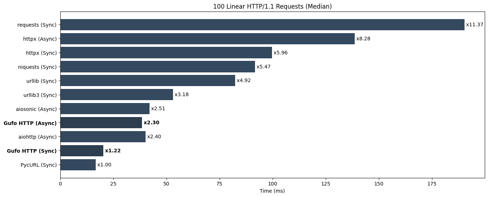
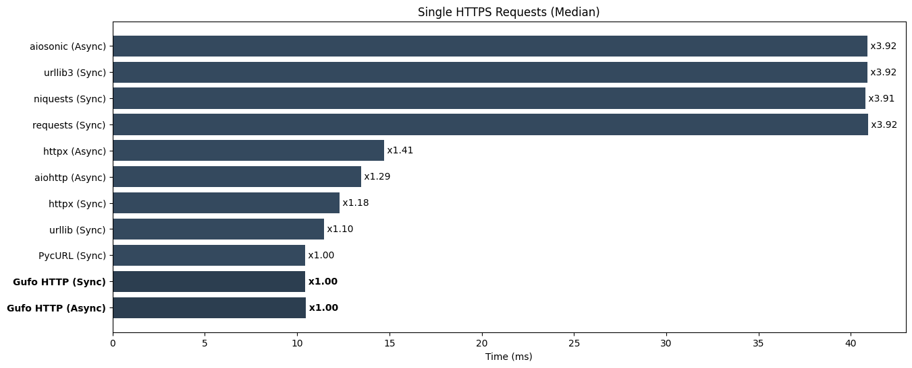

---
hide:
    - navigation
---
# Python HTTP Clients Benchmark

!!! warning "Disclaimer"

    All following information is provided only for reference.
    These tests are performed by [Gufo Labs][Gufo Labs] to estimate the performance
    of [Gufo HTTP][Gufo HTTP] against major competitors, so they cannot be considered
    independent and unbiased.

!!! note

    Although performance is an absolute requirement for [Gufo Stack][Gufo Stack],
    other factors such as maturity, community, features, examples, and existing code base
    should also be considered.

## Abstract
This benchmark evaluates several Python HTTP client libraries:

- [Gufo HTTP][Gufo HTTP] (current version)
- [aiohttp][aiohttp] (3.9.3)
- [aiosonic][aiosonic] (0.18.0)
- [httpx][httpx] (0.27)
- [requests][requests] (2.31.0)
- [niquests][niquests] (3.5.2)
- [PycURL][pycurl] (7.45.3)
- [urllib][urllib] from Python standard library
- [urllib3][urllib3] (2.2.1)

The evaluation covers the following aspects:

* Performance in synchronous (blocking) mode, if supported.
* Performance in asynchronous (non-blocking) mode, if supported.
* Performance in plain-text (HTTP) and encrypted (HTTPS) modes.
* Ability to maintain pools of connections.
* The efficiency of the resolver.
* Ability to release GIL in multi-threaded applications.

All benchmarks are performed against a local nginx installation
using wrapper, provided by `gufo.http.httpd`.

The benchmarking environment utilizes an AWS EC2 t2.xlarge (64-bit) instance running Debian 12. 
Median values are used for benchmark ranking.

## Preparing

Start clear AWS EC2 t2.xlarge (64 bit) instance with Debian 12.

Prepare node:
```
sudo apt-get update
sudo apt-get install --yes git python3.11-venv
python3 -m venv bench
cd bench
. bin/activate
```

Clone repo:
```
git clone https://github.com/gufolabs/gufo_http.git
cd gufo_http
```

Install local nginx:
```
./tools/build/setup-nginx.sh
```

Install dependencies:

```
pip3 install -e .[test,bench[ gufo-http
```

## HTTP/1.1 Requests

### Single Requests

Perform http requests to read 1kb text file. This test evaluates:

* The cost of client's initialization.
* The efficiency of the network code.
* The efficiency of the resolver.
* The efficiency HTTP/1.1 parser. 

Run tests:
```
pytest benchmarks/test_single_x100_1k.py
```

**Results (lower is better)**
```
================================================================= test session starts =================================================================
platform linux -- Python 3.11.2, pytest-7.4.3, pluggy-1.4.0
benchmark: 4.0.0 (defaults: timer=time.perf_counter disable_gc=False min_rounds=5 min_time=0.000005 max_time=1.0 calibration_precision=10 warmup=False warmup_iterations=100000)
rootdir: /home/admin/bench/gufo_http
plugins: anyio-4.3.0, benchmark-4.0.0
collected 11 items                                                                                                                                    

benchmarks/test_single_x100_1k.py ...........                                                                                                   [100%]


----------------------------------------------------------------------------------------------- benchmark: 11 tests -----------------------------------------------------------------------------------------------
Name (time in us)                Min                    Max                   Mean                StdDev                 Median                   IQR            Outliers         OPS            Rounds  Iterations
-------------------------------------------------------------------------------------------------------------------------------------------------------------------------------------------------------------------
test_urllib3_sync           315.5930 (1.0)       1,953.4650 (1.0)         610.2618 (1.0)        330.4382 (1.0)         439.0200 (1.0)        404.1450 (1.0)         70;11  1,638.6410 (1.0)         401           1
test_pycurl_sync            352.5550 (1.12)      2,269.8040 (1.16)        806.7672 (1.32)       420.9771 (1.27)        643.1680 (1.47)       623.1905 (1.54)         20;1  1,239.5149 (0.76)         84           1
test_urllib_sync            406.5380 (1.29)      2,557.0080 (1.31)        841.9888 (1.38)       372.7995 (1.13)        764.8350 (1.74)       507.5600 (1.26)       174;16  1,187.6643 (0.72)        679           1
test_gufo_http_sync         645.2300 (2.04)      1,974.2670 (1.01)      1,024.7860 (1.68)       350.1131 (1.06)        887.5525 (2.02)       489.2600 (1.21)         11;1    975.8135 (0.60)         62           1
test_gufo_http_async        788.4390 (2.50)      5,664.0910 (2.90)      1,506.6534 (2.47)       614.0673 (1.86)      1,349.7370 (3.07)       715.2520 (1.77)        94;16    663.7227 (0.41)        427           1
test_niquests_sync        1,041.0590 (3.30)      3,306.7660 (1.69)      1,784.9572 (2.92)       524.2528 (1.59)      1,757.2750 (4.00)       792.8572 (1.96)        105;0    560.2375 (0.34)        295           1
test_requests_sync        1,142.8490 (3.62)      4,356.9150 (2.23)      1,980.0989 (3.24)       540.1271 (1.63)      1,878.3090 (4.28)       688.4175 (1.70)         38;2    505.0253 (0.31)        128           1
test_aiosonic_async       1,314.5540 (4.17)     26,605.4950 (13.62)     2,439.8901 (4.00)     1,353.5612 (4.10)      2,288.9965 (5.21)       870.0770 (2.15)         15;8    409.8545 (0.25)        414           1
test_aiohttp_async        1,522.4400 (4.82)      4,332.3290 (2.22)      2,410.5835 (3.95)       546.5448 (1.65)      2,362.1815 (5.38)       644.2570 (1.59)        64;11    414.8373 (0.25)        226           1
test_httpx_sync          29,020.7400 (91.96)    44,995.3310 (23.03)    31,439.1071 (51.52)    3,381.3880 (10.23)    30,473.2290 (69.41)    1,448.3905 (3.58)          2;2     31.8075 (0.02)         28           1
test_httpx_async         31,839.8170 (100.89)   40,042.2010 (20.50)    34,166.0839 (55.99)    2,136.0948 (6.46)     33,778.5725 (76.94)    2,489.8810 (6.16)          4;1     29.2688 (0.02)         18           1
-------------------------------------------------------------------------------------------------------------------------------------------------------------------------------------------------------------------

Legend:
  Outliers: 1 Standard Deviation from Mean; 1.5 IQR (InterQuartile Range) from 1st Quartile and 3rd Quartile.
  OPS: Operations Per Second, computed as 1 / Mean
================================================================= 11 passed in 9.41s ==================================================================
```


*Lower is better*

### 100 Linear Requests

Perform set of 100 linear http requests to read 1kb text file using single client session
whenever possible. This test evaluates:

* The efficiency of the network code.
* The efficency of the HTTP/1.1 parser.
* An ability to maintain connection pools.

Run tests:
```
pytest benchmarks/test_linear_x100_1k.py
```

**Results (lower is better)**
```
================================================================= test session starts =================================================================
platform linux -- Python 3.11.2, pytest-7.4.3, pluggy-1.4.0
benchmark: 4.0.0 (defaults: timer=time.perf_counter disable_gc=False min_rounds=5 min_time=0.000005 max_time=1.0 calibration_precision=10 warmup=False warmup_iterations=100000)
rootdir: /home/admin/bench/gufo_http
plugins: anyio-4.3.0, benchmark-4.0.0
collected 11 items                                                                                                                                    

benchmarks/test_linear_x100_1k.py ...........                                                                                                   [100%]


----------------------------------------------------------------------------------- benchmark: 11 tests ------------------------------------------------------------------------------------
Name (time in ms)             Min                 Max                Mean            StdDev              Median               IQR            Outliers      OPS            Rounds  Iterations
--------------------------------------------------------------------------------------------------------------------------------------------------------------------------------------------
test_pycurl_sync          12.2676 (1.0)       25.4155 (1.0)       17.3400 (1.0)      2.9618 (1.18)      16.7385 (1.0)      3.9695 (1.07)         16;1  57.6702 (1.0)          57           1
test_gufo_http_sync       16.3684 (1.33)      37.9210 (1.49)      20.7391 (1.20)     3.4916 (1.39)      20.3685 (1.22)     4.2991 (1.16)         12;1  48.2180 (0.84)         58           1
test_aiohttp_async        33.9824 (2.77)      48.9004 (1.92)      40.0792 (2.31)     3.5440 (1.41)      40.1342 (2.40)     4.7475 (1.28)         10;0  24.9506 (0.43)         27           1
test_gufo_http_async      34.3208 (2.80)      55.8114 (2.20)      39.9312 (2.30)     5.4085 (2.16)      38.5485 (2.30)     6.2433 (1.69)          3;2  25.0431 (0.43)         25           1
test_aiosonic_async       37.0986 (3.02)      50.8252 (2.00)      42.6358 (2.46)     3.8782 (1.55)      42.0837 (2.51)     6.5579 (1.77)          7;0  23.4545 (0.41)         24           1
test_urllib3_sync         46.4213 (3.78)      63.7727 (2.51)      53.7701 (3.10)     4.4014 (1.75)      53.1810 (3.18)     4.7094 (1.27)          6;1  18.5977 (0.32)         18           1
test_urllib_sync          76.5546 (6.24)      88.3289 (3.48)      82.3095 (4.75)     3.0507 (1.22)      82.4179 (4.92)     4.1461 (1.12)          3;0  12.1493 (0.21)         13           1
test_niquests_sync        83.6885 (6.82)     118.0402 (4.64)      93.3783 (5.39)     9.3339 (3.72)      91.6432 (5.47)     6.9887 (1.89)          2;1  10.7091 (0.19)         11           1
test_httpx_sync           91.5660 (7.46)     103.7892 (4.08)      99.5922 (5.74)     3.6278 (1.45)      99.7707 (5.96)     4.5265 (1.22)          2;1  10.0409 (0.17)         10           1
test_httpx_async         135.8147 (11.07)    142.9130 (5.62)     139.1866 (8.03)     2.5082 (1.0)      138.5708 (8.28)     3.7021 (1.0)           2;0   7.1846 (0.12)          7           1
test_requests_sync       180.6693 (14.73)    193.1162 (7.60)     188.7409 (10.88)    4.9108 (1.96)     190.3143 (11.37)    7.2885 (1.97)          1;0   5.2983 (0.09)          6           1
--------------------------------------------------------------------------------------------------------------------------------------------------------------------------------------------

Legend:
  Outliers: 1 Standard Deviation from Mean; 1.5 IQR (InterQuartile Range) from 1st Quartile and 3rd Quartile.
  OPS: Operations Per Second, computed as 1 / Mean
================================================================= 11 passed in 15.62s =================================================================
```


*Lower is better*

### 100 Parallel Requests

Perform 100 HTTP/1.1 requests to read 1kb text file with concurrency of 4 maintaininng
single client session per thread/coroutine.

* The efficiency of the network code.
* The efficency of the HTTP/1.1 parser.
* An ability to maintain connection pools.
* Granularity of the internal locks.
* Ability to release GIL when runnning native code.

Run tests:
```
pytest benchmarks/test_p4_x100_1k.py
```

**Results (lower is better)**
```
================================================================= test session starts =================================================================
platform linux -- Python 3.11.2, pytest-7.4.3, pluggy-1.4.0
benchmark: 4.0.0 (defaults: timer=time.perf_counter disable_gc=False min_rounds=5 min_time=0.000005 max_time=1.0 calibration_precision=10 warmup=False warmup_iterations=100000)
rootdir: /home/admin/bench/gufo_http
plugins: anyio-4.3.0, benchmark-4.0.0
collected 11 items                                                                                                                                    

benchmarks/test_p4_x100_1k.py ...........                                                                                                       [100%]


------------------------------------------------------------------------------------- benchmark: 11 tests -------------------------------------------------------------------------------------
Name (time in ms)             Min                 Max                Mean             StdDev              Median                IQR            Outliers       OPS            Rounds  Iterations
-----------------------------------------------------------------------------------------------------------------------------------------------------------------------------------------------
test_gufo_http_sync        7.0383 (1.0)       13.9629 (1.0)        9.4300 (1.0)       1.4689 (1.08)       9.1168 (1.0)       1.6141 (1.0)          24;5  106.0445 (1.0)          95           1
test_pycurl_sync           7.4035 (1.05)      14.6372 (1.05)      10.9820 (1.16)      1.3631 (1.0)       10.8603 (1.19)      1.7449 (1.08)         24;2   91.0579 (0.86)         97           1
test_gufo_http_async      21.8823 (3.11)      42.1156 (3.02)      28.1519 (2.99)      4.4911 (3.29)      27.5413 (3.02)      3.2355 (2.00)          8;4   35.5216 (0.33)         37           1
test_aiosonic_async       25.7488 (3.66)      32.4308 (2.32)      28.4868 (3.02)      1.5410 (1.13)      28.2754 (3.10)      2.2880 (1.42)          8;0   35.1039 (0.33)         34           1
test_aiohttp_async        27.2243 (3.87)      34.4230 (2.47)      30.4883 (3.23)      1.5876 (1.16)      30.3699 (3.33)      2.1031 (1.30)         10;0   32.7995 (0.31)         32           1
test_urllib_sync          44.1667 (6.28)      57.7049 (4.13)      49.5278 (5.25)      3.9345 (2.89)      48.6588 (5.34)      6.7631 (4.19)          6;0   20.1907 (0.19)         19           1
test_urllib3_sync         59.2323 (8.42)      72.4158 (5.19)      64.3498 (6.82)      3.8982 (2.86)      63.7425 (6.99)      4.1363 (2.56)          5;2   15.5401 (0.15)         16           1
test_niquests_sync       100.4601 (14.27)    139.2160 (9.97)     110.5149 (11.72)    10.8800 (7.98)     106.8657 (11.72)     5.8011 (3.59)          1;1    9.0486 (0.09)         10           1
test_requests_sync       161.4683 (22.94)    174.5389 (12.50)    169.3991 (17.96)     4.6770 (3.43)     170.5587 (18.71)     5.6301 (3.49)          2;0    5.9032 (0.06)          6           1
test_httpx_sync          161.8872 (23.00)    192.4557 (13.78)    175.4736 (18.61)    11.1773 (8.20)     172.9252 (18.97)    16.5080 (10.23)         2;0    5.6989 (0.05)          6           1
test_httpx_async         211.6434 (30.07)    226.0049 (16.19)    217.8645 (23.10)     6.5345 (4.79)     216.3168 (23.73)    12.0336 (7.46)          1;0    4.5900 (0.04)          5           1
-----------------------------------------------------------------------------------------------------------------------------------------------------------------------------------------------

Legend:
  Outliers: 1 Standard Deviation from Mean; 1.5 IQR (InterQuartile Range) from 1st Quartile and 3rd Quartile.
  OPS: Operations Per Second, computed as 1 / Mean
================================================================= 11 passed in 15.82s =================================================================
```


*Lower is better*

## HTTPS Requests

### Single Requests

Perform HTTP/2 requests to read 1kb text file. This test evaluates:

* The cost of client's initialization.
* The efficiency of the network code.
* The efficiency HTTP/1.1 or HTTP/2 parser. 
* The efficency of the crypto.
* The efficiency of the resolver.

Run tests:
```
pytest benchmarks/test_https_single_x100_1k.py
```

**Results (lower is better)**
```
================================================================= test session starts =================================================================
platform linux -- Python 3.11.2, pytest-7.4.3, pluggy-1.4.0
benchmark: 4.0.0 (defaults: timer=time.perf_counter disable_gc=False min_rounds=5 min_time=0.000005 max_time=1.0 calibration_precision=10 warmup=False warmup_iterations=100000)
rootdir: /home/admin/bench/gufo_http
plugins: anyio-4.3.0, benchmark-4.0.0
collected 11 items                                                                                                                                    

benchmarks/test_https_single_x100_1k.py ...........                                                                                             [100%]


--------------------------------------------------------------------------------- benchmark: 11 tests ----------------------------------------------------------------------------------
Name (time in ms)            Min                Max               Mean            StdDev             Median               IQR            Outliers      OPS            Rounds  Iterations
----------------------------------------------------------------------------------------------------------------------------------------------------------------------------------------
test_gufo_http_async      8.7915 (1.0)      12.2763 (1.0)      10.6205 (1.01)     0.7521 (1.17)     10.4619 (1.00)     1.0622 (1.30)         26;0  94.1573 (0.99)         87           1
test_gufo_http_sync       8.8296 (1.00)     15.8669 (1.29)     10.6821 (1.02)     1.2183 (1.89)     10.4338 (1.0)      1.1554 (1.41)         13;3  93.6144 (0.98)         71           1
test_pycurl_sync          9.2207 (1.05)     12.4415 (1.01)     10.4905 (1.0)      0.6444 (1.0)      10.4416 (1.00)     0.8200 (1.0)          16;2  95.3244 (1.0)          62           1
test_urllib_sync          9.6548 (1.10)     20.3480 (1.66)     11.7571 (1.12)     1.2565 (1.95)     11.4713 (1.10)     0.8705 (1.06)          5;4  85.0547 (0.89)         86           1
test_httpx_sync          10.5788 (1.20)     14.6097 (1.19)     12.2516 (1.17)     0.8117 (1.26)     12.2890 (1.18)     0.9669 (1.18)         25;1  81.6223 (0.86)         71           1
test_aiohttp_async       12.3006 (1.40)     17.2634 (1.41)     13.5143 (1.29)     1.0618 (1.65)     13.4668 (1.29)     0.8817 (1.08)          2;1  73.9956 (0.78)         18           1
test_httpx_async         13.1090 (1.49)     16.3325 (1.33)     14.7676 (1.41)     0.7922 (1.23)     14.7109 (1.41)     1.1775 (1.44)         16;0  67.7158 (0.71)         43           1
test_requests_sync       38.4122 (4.37)     44.0851 (3.59)     41.0690 (3.91)     1.0758 (1.67)     40.9266 (3.92)     0.9473 (1.16)          3;2  24.3493 (0.26)         20           1
test_niquests_sync       38.5521 (4.39)     42.7355 (3.48)     40.8687 (3.90)     1.0084 (1.56)     40.7714 (3.91)     1.1362 (1.39)          9;1  24.4686 (0.26)         25           1
test_urllib3_sync        38.7738 (4.41)     44.2748 (3.61)     40.9581 (3.90)     1.4479 (2.25)     40.8991 (3.92)     2.1439 (2.61)          8;0  24.4152 (0.26)         26           1
test_aiosonic_async      38.9962 (4.44)     45.1008 (3.67)     41.0321 (3.91)     1.5977 (2.48)     40.8883 (3.92)     1.9366 (2.36)          9;1  24.3712 (0.26)         24           1
----------------------------------------------------------------------------------------------------------------------------------------------------------------------------------------

Legend:
  Outliers: 1 Standard Deviation from Mean; 1.5 IQR (InterQuartile Range) from 1st Quartile and 3rd Quartile.
  OPS: Operations Per Second, computed as 1 / Mean
========================================================== 11 passed, 45 warnings in 15.69s ===========================================================
```


*Lower is better*

### 100 Linear Requests
Perform set of 100 linear HTTPS requests to read 1kb text file using single client session
whenever possible. This test evaluates:

* The efficiency of the network code.
* The efficency of the HTTP/1.1 parser.
* An ability to maintain connection pools.
* The efficency of the crypto.

Run tests:
```
pytest benchmarks/test_https_linear_x100_1k.py
```

**Results (lower is better)**

```
================================================================= test session starts =================================================================
platform linux -- Python 3.11.2, pytest-7.4.3, pluggy-1.4.0
benchmark: 4.0.0 (defaults: timer=time.perf_counter disable_gc=False min_rounds=5 min_time=0.000005 max_time=1.0 calibration_precision=10 warmup=False warmup_iterations=100000)
rootdir: /home/admin/bench/gufo_http
plugins: anyio-4.3.0, benchmark-4.0.0
collected 11 items                                                                                                                                    

benchmarks/test_https_linear_x100_1k.py ...........                                                                                             [100%]


---------------------------------------------------------------------------------------- benchmark: 11 tests -----------------------------------------------------------------------------------------
Name (time in ms)               Min                   Max                  Mean             StdDev                Median                IQR            Outliers      OPS            Rounds  Iterations
------------------------------------------------------------------------------------------------------------------------------------------------------------------------------------------------------
test_pycurl_sync            23.7046 (1.0)         34.5084 (1.0)         28.0373 (1.0)       2.7286 (1.05)        27.5175 (1.0)       3.1725 (1.51)         13;1  35.6668 (1.0)          36           1
test_gufo_http_sync         29.9783 (1.26)        43.9089 (1.27)        34.6652 (1.24)      3.4124 (1.31)        34.1431 (1.24)      3.3721 (1.60)          6;2  28.8473 (0.81)         27           1
test_gufo_http_async        46.8830 (1.98)        60.8049 (1.76)        52.9559 (1.89)      3.4813 (1.34)        53.4698 (1.94)      3.3365 (1.59)          6;1  18.8836 (0.53)         20           1
test_aiohttp_async          54.6583 (2.31)        67.3119 (1.95)        59.1695 (2.11)      3.4653 (1.33)        58.1128 (2.11)      3.0986 (1.47)          3;1  16.9006 (0.47)         12           1
test_httpx_sync             81.5782 (3.44)        92.6393 (2.68)        86.0377 (3.07)      2.6015 (1.0)         85.8659 (3.12)      2.1049 (1.0)           2;2  11.6228 (0.33)         12           1
test_aiosonic_async         83.6425 (3.53)        92.7221 (2.69)        88.8669 (3.17)      3.0862 (1.19)        88.5831 (3.22)      4.7266 (2.25)          4;0  11.2528 (0.32)         11           1
test_urllib3_sync           93.8056 (3.96)       108.2151 (3.14)       103.6100 (3.70)      4.4636 (1.72)       104.2995 (3.79)      5.2626 (2.50)          3;1   9.6516 (0.27)         10           1
test_httpx_async           121.2678 (5.12)       129.0288 (3.74)       125.5163 (4.48)      2.7471 (1.06)       125.2434 (4.55)      4.4465 (2.11)          3;0   7.9671 (0.22)          8           1
test_niquests_sync         139.6578 (5.89)       149.3103 (4.33)       145.1738 (5.18)      3.3405 (1.28)       145.8421 (5.30)      3.7032 (1.76)          2;0   6.8883 (0.19)          6           1
test_urllib_sync         1,128.9319 (47.63)    1,143.7361 (33.14)    1,138.7279 (40.61)     5.9014 (2.27)     1,140.5120 (41.45)     7.1488 (3.40)          1;0   0.8782 (0.02)          5           1
test_requests_sync       4,121.8836 (173.89)   4,151.7480 (120.31)   4,131.9819 (147.37)   11.9202 (4.58)     4,129.1534 (150.06)   14.5257 (6.90)          1;0   0.2420 (0.01)          5           1
------------------------------------------------------------------------------------------------------------------------------------------------------------------------------------------------------

Legend:
  Outliers: 1 Standard Deviation from Mean; 1.5 IQR (InterQuartile Range) from 1st Quartile and 3rd Quartile.
  OPS: Operations Per Second, computed as 1 / Mean
==================================================== 11 passed, 1215 warnings in 62.84s (0:01:02) =====================================================
```


*Lower is better*

### 100 Parallel Requests
Perform 100 HTTPS requests to read 1kb text file with concurrency of 4 maintaininng
single client session per thread/coroutine.

* The efficiency of the network code.
* The efficency of the HTTP/1.1 parser.
* An ability to maintain connection pools.
* Granularity of the internal locks.
* Ability to release GIL when runnning native code.

Run tests:
```
pytest benchmarks/test_https_p4_x100_1k.py
```

**Results (lower is better)**
```
================================================================= test session starts =================================================================
platform linux -- Python 3.11.2, pytest-7.4.3, pluggy-1.4.0
benchmark: 4.0.0 (defaults: timer=time.perf_counter disable_gc=False min_rounds=5 min_time=0.000005 max_time=1.0 calibration_precision=10 warmup=False warmup_iterations=100000)
rootdir: /home/admin/bench/gufo_http
plugins: anyio-4.3.0, benchmark-4.0.0
collected 11 items                                                                                                                                    

benchmarks/test_https_p4_x100_1k.py ...........                                                                                                 [100%]


----------------------------------------------------------------------------------------- benchmark: 11 tests ------------------------------------------------------------------------------------------
Name (time in ms)               Min                   Max                  Mean              StdDev                Median                 IQR            Outliers      OPS            Rounds  Iterations
--------------------------------------------------------------------------------------------------------------------------------------------------------------------------------------------------------
test_gufo_http_sync         18.8254 (1.0)         30.3264 (1.0)         25.7748 (1.0)        3.1315 (1.20)        26.6940 (1.0)        2.8348 (1.0)          10;4  38.7975 (1.0)          34           1
test_pycurl_sync            21.6306 (1.15)        32.7644 (1.08)        27.3538 (1.06)       2.6036 (1.0)         27.3959 (1.03)       3.4922 (1.23)         13;0  36.5580 (0.94)         37           1
test_gufo_http_async        37.4205 (1.99)        65.0476 (2.14)        49.4927 (1.92)       7.8136 (3.00)        47.2254 (1.77)       7.0210 (2.48)          8;2  20.2050 (0.52)         21           1
test_aiohttp_async          52.3300 (2.78)        69.1030 (2.28)        58.7268 (2.28)       5.1573 (1.98)        56.9829 (2.13)       5.0403 (1.78)          3;2  17.0280 (0.44)         13           1
test_httpx_sync             98.6042 (5.24)       117.8161 (3.88)       105.8565 (4.11)       6.3216 (2.43)       104.5910 (3.92)       8.9421 (3.15)          3;0   9.4468 (0.24)          9           1
test_httpx_async           122.4068 (6.50)       140.9107 (4.65)       132.2846 (5.13)       8.4108 (3.23)       133.1786 (4.99)      15.8468 (5.59)          3;0   7.5595 (0.19)          8           1
test_aiosonic_async        162.1061 (8.61)       213.1706 (7.03)       178.6271 (6.93)      16.3708 (6.29)       174.2818 (6.53)       9.2994 (3.28)          2;1   5.5983 (0.14)          7           1
test_urllib3_sync          171.9625 (9.13)       195.0597 (6.43)       184.1284 (7.14)       8.2140 (3.15)       184.4066 (6.91)      11.6343 (4.10)          2;0   5.4310 (0.14)          6           1
test_niquests_sync         228.0948 (12.12)      245.1454 (8.08)       236.8987 (9.19)       7.9569 (3.06)       235.6501 (8.83)      15.1074 (5.33)          3;0   4.2212 (0.11)          5           1
test_urllib_sync           340.0895 (18.07)      407.2020 (13.43)      378.0052 (14.67)     25.1730 (9.67)       377.3775 (14.14)     31.8001 (11.22)         2;0   2.6455 (0.07)          5           1
test_requests_sync       2,322.0456 (123.35)   2,610.2015 (86.07)    2,448.8615 (95.01)    116.5830 (44.78)    2,444.3720 (91.57)    187.1698 (66.03)         2;0   0.4084 (0.01)          5           1
--------------------------------------------------------------------------------------------------------------------------------------------------------------------------------------------------------

Legend:
  Outliers: 1 Standard Deviation from Mean; 1.5 IQR (InterQuartile Range) from 1st Quartile and 3rd Quartile.
  OPS: Operations Per Second, computed as 1 / Mean
========================================================= 11 passed, 1131 warnings in 39.64s ==========================================================
```


*Lower is better*

## Feedback

If you have any ideas, comment, or thoughts on benchmark suite,
feel free to [discuss it on GitHub][discussion].

[Gufo Labs]: https://gufolabs.com/
[Gufo Stack]: https://docs.gufolabs.com/
[Gufo HTTP]: https://docs.gufolabs.com/gufo_http/
[aiohttp]: https://docs.aiohttp.org/en/stable/
[aiosonic]: https://aiosonic.readthedocs.io/en/latest/
[httpx]: https://www.python-httpx.org
[requests]: https://requests.readthedocs.io/en/latest/
[niquests]: https://niquests.readthedocs.io/en/stable/
[pycurl]: http://pycurl.io/
[urllib]: https://docs.python.org/3/library/urllib.request.html#module-urllib.request
[urllib3]: https://urllib3.readthedocs.io/en/stable/
[discussion]: https://github.com/gufolabs/gufo_http/discussions/2