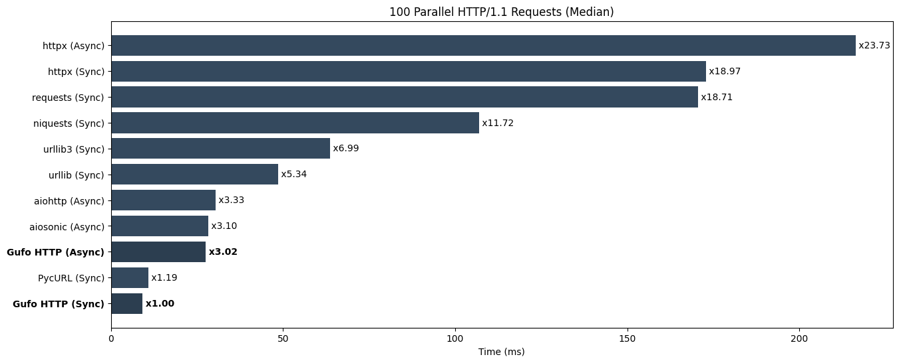

---
hide:
    - navigation
---
# Python HTTP Clients Benchmark

!!! warning

    All following information is provided only for reference.
    These tests are performed by [Gufo Labs][Gufo Labs] to estimate the performance
    of [Gufo HTTP][Gufo HTTP] against major competitors, so they cannot be considered
    independent and unbiased.

    Although performance is an absolute requirement for [Gufo Stack][Gufo Stack],
    other factors such as maturity, community, features, examples, and existing code base
    should also be considered.

We're comparing:

- [Gufo HTTP][Gufo HTTP] (current version)
- [aiohttp][aiohttp]
- [aiosonic][aiosonic]
- [httpx][httpx]
- [requests][requests]
- [niquests][niquests]
- [PycURL][pycurl]
- [urllib][urllib] from Python standard library
- [urllibb3][urllib3]

Both synchronous and asynchronous tests are conducted if supported by the library.
Libraries are tested against a local nginx installation provided by the `gufo.http.httpd` wrapper.
We're using median value to rank the benchmarks.

## Preparing

We're using AWS EC2 t2.xlarge (64 bit) instance with Debian 12.

Prepare node:
```
sudo apt-get update
sudo apt-get install --yes git python3.11-venv
python3 -m venv bench
cd bench
. bin/activate
```

Clone repo:
```
git clone https://github.com/gufolabs/gufo_http.git
cd gufo_http
```

Install local nginx:
```
./tools/build/setup-nginx.sh
```

Install dependencies:

```
pip3 install -r .requirements/test.txt -r .requirements/bench.txt gufo-http
```

## Single HTTP/1.1 Requests

Perform http requests to read 1kb text file. This test evaluates:

* The cost of client's initialization.
* The efficiency of the network code.
* The efficiency HTTP/1.1 parser. 

Run tests:
```
pytest benchmarks/test_single_x100_1k.py
```

**Results (lower is better)**
```
================================================================= test session starts =================================================================
platform linux -- Python 3.11.2, pytest-7.4.3, pluggy-1.4.0
benchmark: 4.0.0 (defaults: timer=time.perf_counter disable_gc=False min_rounds=5 min_time=0.000005 max_time=1.0 calibration_precision=10 warmup=False warmup_iterations=100000)
rootdir: /home/admin/bench/gufo_http
plugins: anyio-4.3.0, benchmark-4.0.0
collected 11 items                                                                                                                                    

benchmarks/test_single_x100_1k.py ...........                                                                                                   [100%]


----------------------------------------------------------------------------------------------- benchmark: 11 tests -----------------------------------------------------------------------------------------------
Name (time in us)                Min                    Max                   Mean                StdDev                 Median                   IQR            Outliers         OPS            Rounds  Iterations
-------------------------------------------------------------------------------------------------------------------------------------------------------------------------------------------------------------------
test_urllib3_sync           559.6880 (1.0)       1,246.9130 (1.67)        612.8979 (1.0)         44.8409 (1.56)        607.6110 (1.0)         25.8205 (1.0)         37;33  1,631.5931 (1.0)         697           1
test_pycurl_sync            572.5990 (1.02)        748.3810 (1.0)         622.1162 (1.02)        34.7881 (1.21)        617.5100 (1.02)        40.2622 (1.56)         20;3  1,607.4169 (0.99)         73           1
test_urllib_sync            658.8650 (1.18)        868.8990 (1.16)        720.5614 (1.18)        28.7254 (1.0)         716.4400 (1.18)        31.2975 (1.21)       208;26  1,387.8069 (0.85)        751           1
test_gufo_http_sync         932.3560 (1.67)      2,139.1020 (2.86)      1,043.3998 (1.70)       177.0928 (6.17)      1,005.6240 (1.66)        62.1935 (2.41)          1;4    958.4054 (0.59)         45           1
test_gufo_http_async      1,330.7690 (2.38)      1,622.9070 (2.17)      1,435.8727 (2.34)        46.7674 (1.63)      1,433.4990 (2.36)        60.2895 (2.33)        119;8    696.4405 (0.43)        405           1
test_niquests_sync        1,542.7730 (2.76)     19,614.0250 (26.21)     1,779.6494 (2.90)       830.0737 (28.90)     1,661.4445 (2.73)       101.0680 (3.91)        8;108    561.9084 (0.34)        494           1
test_requests_sync        1,761.6280 (3.15)      2,453.6630 (3.28)      1,909.8052 (3.12)       140.1992 (4.88)      1,856.9455 (3.06)       112.2350 (4.35)          8;4    523.6136 (0.32)         46           1
test_aiosonic_async       1,959.2180 (3.50)      3,370.8260 (4.50)      2,154.0451 (3.51)       208.8863 (7.27)      2,093.3120 (3.45)        83.0015 (3.21)        40;41    464.2428 (0.28)        404           1
test_aiohttp_async        2,151.3730 (3.84)      8,118.6410 (10.85)     2,292.1203 (3.74)       317.2131 (11.04)     2,267.8740 (3.73)        73.7982 (2.86)          1;7    436.2773 (0.27)        351           1
test_httpx_sync          41,079.3140 (73.40)    54,493.3170 (72.81)    42,657.7260 (69.60)    2,765.8773 (96.29)    41,970.3340 (69.07)      753.7480 (29.19)         1;3     23.4424 (0.01)         22           1
test_httpx_async         42,803.9490 (76.48)    52,177.8810 (69.72)    45,093.8321 (73.57)    2,592.9973 (90.27)    44,251.4320 (72.83)    1,208.5235 (46.80)         2;2     22.1760 (0.01)         15           1
-------------------------------------------------------------------------------------------------------------------------------------------------------------------------------------------------------------------

Legend:
  Outliers: 1 Standard Deviation from Mean; 1.5 IQR (InterQuartile Range) from 1st Quartile and 3rd Quartile.
  OPS: Operations Per Second, computed as 1 / Mean
================================================================= 11 passed in 9.17s ==================================================================
```


## 100 Linear HTTP/1.1 Requests

Perform set of 100 linear http requests to read 1kb text file using single client session
whenever possible. This test evaluates:

* The efficiency of the network code.
* The efficency of the HTTP/1.1 parser.
* An ability to maintain connection pools.

Run tests:
```
pytest benchmarks/test_linear_x100_1k.py
```

**Results (lower is better)**
```
================================================================= test session starts =================================================================
platform linux -- Python 3.11.2, pytest-7.4.3, pluggy-1.4.0
benchmark: 4.0.0 (defaults: timer=time.perf_counter disable_gc=False min_rounds=5 min_time=0.000005 max_time=1.0 calibration_precision=10 warmup=False warmup_iterations=100000)
rootdir: /home/admin/bench/gufo_http
plugins: anyio-4.3.0, benchmark-4.0.0
collected 11 items                                                                                                                                    

benchmarks/test_linear_x100_1k.py ...........                                                                                                   [100%]


----------------------------------------------------------------------------------- benchmark: 11 tests ------------------------------------------------------------------------------------
Name (time in ms)             Min                 Max                Mean            StdDev              Median               IQR            Outliers      OPS            Rounds  Iterations
--------------------------------------------------------------------------------------------------------------------------------------------------------------------------------------------
test_pycurl_sync          14.8365 (1.0)       16.3861 (1.0)       15.5327 (1.0)      0.3498 (1.0)       15.5279 (1.0)      0.4758 (1.0)          20;0  64.3803 (1.0)          59           1
test_gufo_http_sync       15.6296 (1.05)      18.9774 (1.16)      17.0747 (1.10)     0.6889 (1.97)      16.9616 (1.09)     0.9595 (2.02)         18;0  58.5661 (0.91)         58           1
test_aiohttp_async        41.4606 (2.79)      43.2958 (2.64)      42.4532 (2.73)     0.5326 (1.52)      42.4940 (2.74)     0.7613 (1.60)          9;0  23.5553 (0.37)         23           1
test_gufo_http_async      44.5912 (3.01)      49.0183 (2.99)      46.2745 (2.98)     1.1522 (3.29)      46.1390 (2.97)     1.0644 (2.24)          7;2  21.6102 (0.34)         22           1
test_aiosonic_async       44.7362 (3.02)      48.9211 (2.99)      46.3734 (2.99)     0.8680 (2.48)      46.3936 (2.99)     0.7834 (1.65)          5;2  21.5641 (0.33)         22           1
test_urllib3_sync         58.2859 (3.93)      59.8772 (3.65)      59.0778 (3.80)     0.4955 (1.42)      59.0435 (3.80)     0.5773 (1.21)          6;0  16.9268 (0.26)         17           1
test_urllib_sync          70.2436 (4.73)      72.3247 (4.41)      71.5258 (4.60)     0.5289 (1.51)      71.4880 (4.60)     0.5479 (1.15)          4;1  13.9810 (0.22)         14           1
test_niquests_sync        91.8051 (6.19)     109.4231 (6.68)      94.9622 (6.11)     4.8379 (13.83)     93.7023 (6.03)     0.6003 (1.26)          1;2  10.5305 (0.16)         11           1
test_httpx_sync          112.5345 (7.58)     116.1791 (7.09)     114.3526 (7.36)     1.2965 (3.71)     113.8844 (7.33)     2.2858 (4.80)          4;0   8.7449 (0.14)          9           1
test_httpx_async         167.3883 (11.28)    172.2522 (10.51)    168.7584 (10.86)    1.7953 (5.13)     168.3583 (10.84)    1.1404 (2.40)          1;1   5.9256 (0.09)          6           1
test_requests_sync       180.1325 (12.14)    183.1228 (11.18)    182.1927 (11.73)    1.1785 (3.37)     182.7465 (11.77)    1.5222 (3.20)          1;0   5.4887 (0.09)          6           1
--------------------------------------------------------------------------------------------------------------------------------------------------------------------------------------------

Legend:
  Outliers: 1 Standard Deviation from Mean; 1.5 IQR (InterQuartile Range) from 1st Quartile and 3rd Quartile.
  OPS: Operations Per Second, computed as 1 / Mean
================================================================= 11 passed in 15.21s =================================================================
```


## 100 Parallel HTTP/1.1 Requests

Perform 100 HTTP/1.1 requests to read 1kb text file with concurrency of 4 maintaininng
single client session per thread/coroutine.

* The efficiency of the network code.
* The efficency of the HTTP/1.1 parser.
* An ability to maintain connection pools.
* Granularity of the internal locks.
* Ability to release GIL when runnning native code.

Run tests:
```
pytest benchmarks/test_p4_x100_1k.py
```

**Results (lower is better)**
```
================================================================= test session starts =================================================================
platform linux -- Python 3.11.2, pytest-7.4.3, pluggy-1.4.0
benchmark: 4.0.0 (defaults: timer=time.perf_counter disable_gc=False min_rounds=5 min_time=0.000005 max_time=1.0 calibration_precision=10 warmup=False warmup_iterations=100000)
rootdir: /home/admin/bench/gufo_http
plugins: anyio-4.3.0, benchmark-4.0.0
collected 11 items                                                                                                                                    

benchmarks/test_p4_x100_1k.py ...........                                                                                                       [100%]


------------------------------------------------------------------------------------ benchmark: 11 tests ------------------------------------------------------------------------------------
Name (time in ms)             Min                 Max                Mean            StdDev              Median               IQR            Outliers       OPS            Rounds  Iterations
---------------------------------------------------------------------------------------------------------------------------------------------------------------------------------------------
test_gufo_http_sync        7.2836 (1.0)       10.8954 (1.0)        9.1802 (1.0)      0.5346 (1.03)       9.1541 (1.0)      0.5174 (1.04)         25;6  108.9302 (1.0)          92           1
test_pycurl_sync           8.2186 (1.13)      11.0696 (1.02)       9.3183 (1.02)     0.5181 (1.0)        9.2534 (1.01)     0.4962 (1.0)          26;6  107.3162 (0.99)         87           1
test_gufo_http_async      30.1939 (4.15)      40.5446 (3.72)      31.6853 (3.45)     1.8262 (3.52)      31.3115 (3.42)     1.0123 (2.04)          2;2   31.5604 (0.29)         31           1
test_aiosonic_async       34.1517 (4.69)      38.6213 (3.54)      36.0843 (3.93)     1.3087 (2.53)      35.6595 (3.90)     1.8279 (3.68)          9;0   27.7129 (0.25)         27           1
test_aiohttp_async        37.4081 (5.14)      47.7629 (4.38)      39.4416 (4.30)     1.9344 (3.73)      39.0971 (4.27)     0.9056 (1.82)          3;2   25.3539 (0.23)         25           1
test_urllib_sync          41.5838 (5.71)      44.7744 (4.11)      43.2369 (4.71)     0.7841 (1.51)      43.2862 (4.73)     1.1149 (2.25)          7;0   23.1284 (0.21)         23           1
test_urllib3_sync         63.4683 (8.71)      66.6725 (6.12)      64.5508 (7.03)     0.8025 (1.55)      64.5220 (7.05)     1.1252 (2.27)          4;0   15.4917 (0.14)         16           1
test_niquests_sync        99.8689 (13.71)    118.2912 (10.86)    102.6201 (11.18)    5.5534 (10.72)    100.9334 (11.03)    1.6546 (3.33)          1;1    9.7447 (0.09)         10           1
test_requests_sync       161.9760 (22.24)    164.8976 (15.13)    163.5207 (17.81)    1.3422 (2.59)     163.7541 (17.89)    2.5137 (5.07)          3;0    6.1154 (0.06)          6           1
test_httpx_sync          210.2389 (28.86)    225.5404 (20.70)    217.2855 (23.67)    5.8637 (11.32)    218.2690 (23.84)    8.1161 (16.36)         2;0    4.6022 (0.04)          5           1
test_httpx_async         280.2248 (38.47)    290.9817 (26.71)    285.0176 (31.05)    4.2305 (8.17)     284.1745 (31.04)    6.4064 (12.91)         2;0    3.5086 (0.03)          5           1
---------------------------------------------------------------------------------------------------------------------------------------------------------------------------------------------

Legend:
  Outliers: 1 Standard Deviation from Mean; 1.5 IQR (InterQuartile Range) from 1st Quartile and 3rd Quartile.
  OPS: Operations Per Second, computed as 1 / Mean
================================================================= 11 passed in 15.52s =================================================================
```


## Feedback

If you have any ideas, comment, or thoughts on benchmark suite,
feel free to [discuss it on GitHub][discussion].

[Gufo Labs]: https://gufolabs.com/
[Gufo Stack]: https://docs.gufolabs.com/
[Gufo HTTP]: https://docs.gufolabs.com/gufo_http/
[aiohttp]: https://docs.aiohttp.org/en/stable/
[aiosonic]: https://aiosonic.readthedocs.io/en/latest/
[httpx]: https://www.python-httpx.org
[requests]: https://requests.readthedocs.io/en/latest/
[niquests]: https://niquests.readthedocs.io/en/stable/
[pycurl]: http://pycurl.io/
[urllib]: https://docs.python.org/3/library/urllib.request.html#module-urllib.request
[urllib3]: https://urllib3.readthedocs.io/en/stable/
[discussion]: https://github.com/gufolabs/gufo_http/discussions/2